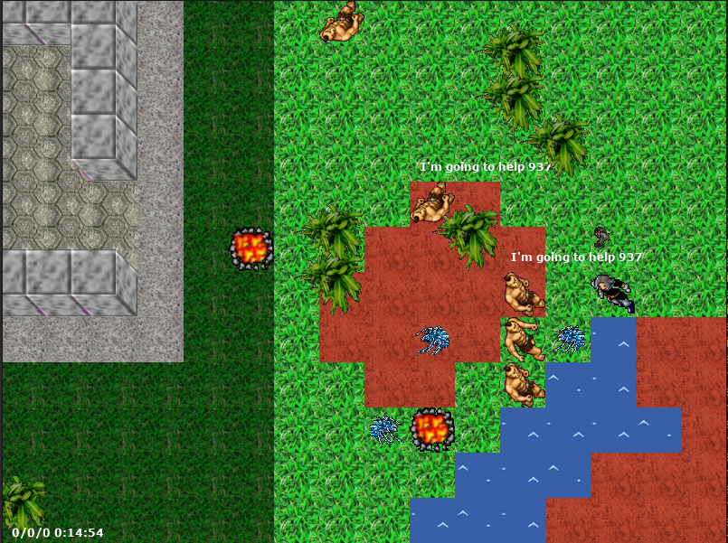

# Subverse

The Subverse Project is a learning environment that aims to present computer course students not only with a final product, in the form of an online multiplayer computer game, in which the student implements the behaviors of the game elements, but a constantly evolving platform. .

Through this platform, students can work in practice several theories presented in computing disciplines, such as Artificial Intelligence, Algorithms, Computer Game Development, Distributed Systems and others. Subverse is composed of implemented parts of a virtual world for the implementation of agents based on the paradigm of multiplayer games that work in a network. Thus, a set of implementations of Subverse modules, and undeveloped modules, show themselves as challenges to students for constant evolution, implementation in improvements based on computational theories. Subverse also suggests the use of opensource technologies, available for free and with very current resources.

In time, Subverse suggests a distributed structure for multiple connections of remote agents for interaction between them in the Subverse virtual world, such as an MMOG (Massive Multiplayer Online Game). However, instead of players controlling their avatars remotely, the actors who must control the avatars are agents involved by the users. Users launch their agents and view their in-game lifecycle through a graphical interface that also remotely connects to the game.

## A few commands to remote connection to Subverse

Subverse start on port 5050

SEND: land
RETURN: \[width,height\](x,y,type)...
DESCRIPTION:

- width integer
- height integer
- x integer [0 to weith-1]
- y integer [0 to height-1]
- type integer
  - 100 ADOBE
  - 101 LITTLELAWN
  - 102 GROUND
  - 103 ROCKS
  - 104 LAWN
  - 300 WATER

SEND: element
RETURN: (x,y,id,type,alive,underAttack,strength,health,food,direction,attacking)...
DESCRITION:

- x integer [0 to weith-1]
- y integer [0 to height-1]
- type integer
  - 1 AVATAR
  - 2 CYCLOPE
  - 3 FIRE
  - 4 TREE
  - 5 SPIDER
  - 6 BAT
  - 200 WALL
- live boolean [0 - false | 1 - true]
- underAttack boolean
- strength integer [0 to 100] (I don't remember)
- health integer [0 to 100]
- food integer [0 to 100] - element food for others
- direction integer
  - 0 DOWN
  - 2 RIGHT
  - 4 UP
  - 6 LEFT
- attacking boolean
